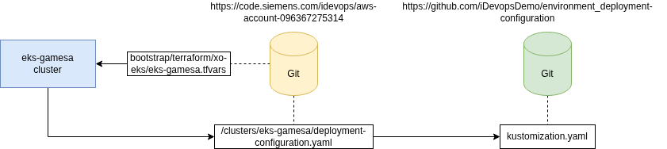

# MQTT-Broker-App Deployment Configuration

This repo contains the deployment configuration files for the MQTT-Broker-App. The deployment is based on the GitOps methodology, which emphasizes using Git repositories as the single source of truth for declarative infrastructure and application configurations. In detail, this deployment uses [FluxCD](https://fluxcd.io/) to manage and automate the deployment process.

## Actual Setup

We using the [AWS Account Template](https://devops.siemens.io/offerings/aws-account-template/overview/) to manage our AWS infrastructure. This template using terraform to bootstrap the AWS environment and provisions a Kubernetes cluster. This cluster on the other hand is managed by FluxCD to deploy anything into the cluster. Basically the flux operator polls the git repository and check the folder `clusters/eks-gamesa` for any changes. In our case, the `gamesa-deployment-configuration.yaml` file pointing to another git repository which contains the actual deployment configuration for the MQTT-Broker-App. What ever FluxCD configuration is put into this repository, FluxCD will automatically deploy it into the cluster.

Here are the link:

* [AWS Account Template Repository](https://code.siemens.com/idevops/aws-account-096367275314/-/tree/main/clusters/eks-gamesa)
* [GAMESA Deployment Configuration Repository](https://code.siemens.com/ssp-self-evolving-software/hypothesis-track/environment/deployment-configuration)

